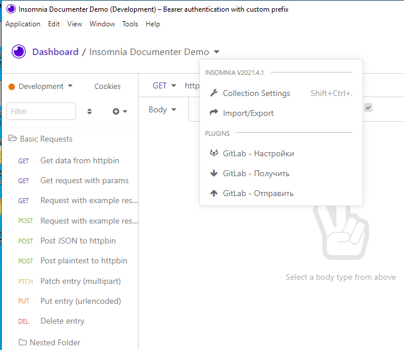
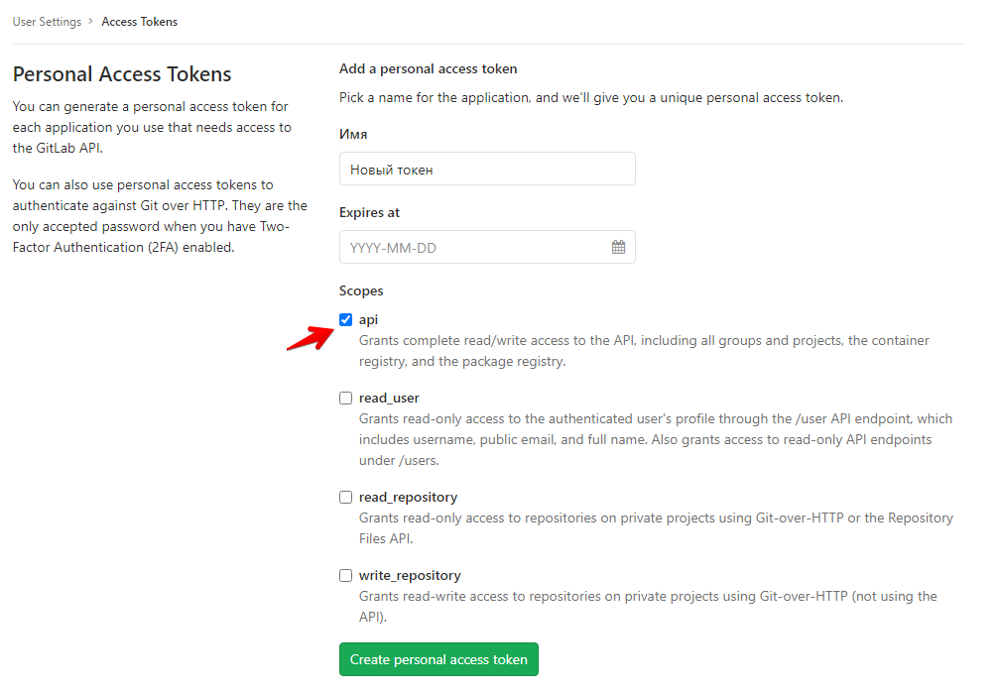

# insomnia-plugin-gitlab

Плагин для **Insomnia**
Синхронизирует коллекцию с репозиторием Gitlab

# Загрузка

```npm insomnia-plugin-gitlab```

# Использование
## Меню



## Настроки


* Можно задать имя файла с путём

## Генерация токена 

